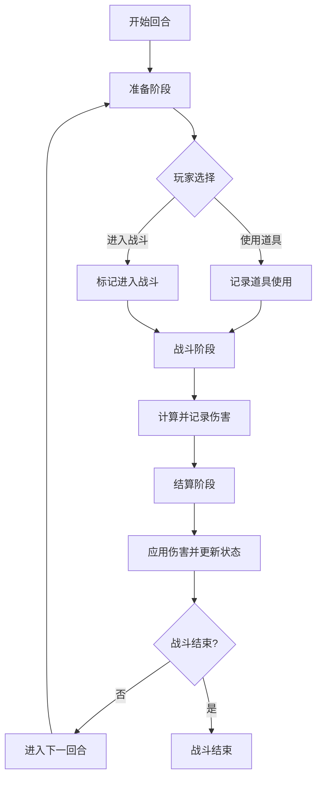

# 回合制战斗游戏

一个基于React、TypeScript和Vite构建的回合制战斗游戏。

## 项目介绍

这是一个简单的回合制战斗游戏，玩家可以通过策略性的回合操作与敌人进行战斗。游戏包含角色系统、道具系统、三阶段回合制战斗机制等核心功能。

## 功能特性

- 三阶段回合制战斗系统（准备→战斗→结算）
- 角色系统（玩家和敌人）
- 道具系统（治疗药水）
- 士兵系统（角色可以携带士兵参与战斗）
- 实时战斗日志
- 响应式UI设计

## 技术栈

- React 18
- TypeScript
- Vite
- Tailwind CSS
- Context API + useReducer 状态管理

## 项目结构

```
src/
├── components/           # React组件
│   ├── battle/          # 战斗相关组件
├── hooks/               # 自定义Hook
├── types/               # TypeScript类型定义
├── utils/               # 工具函数
├── context/             # React Context
├── constants/           # 常量定义
```

## 开发环境

### 环境要求

- Node.js >= 16
- npm 或 yarn

### 安装依赖

```bash
npm install
```

### 启动开发服务器

```bash
npm run dev
```

### 构建生产版本

```bash
npm run build
```

### 预览生产版本

```bash
npm run preview
```

## 核心玩法

### 三阶段回合制战斗系统

游戏采用三阶段回合制战斗系统，每回合严格按照以下顺序执行：

1. **准备阶段**：玩家可以选择使用道具、切换作战梯队或进入战斗
2. **战斗阶段**：计算伤害但不立即结算
3. **结算阶段**：统一结算所有在战斗阶段产生的伤害

### 战斗流程



### 战斗阶段详细流程

1. **准备阶段**：
   - 玩家有30秒时间选择"使用道具"或"进入战斗"
   - 敌人自动选择"进入战斗"
   - 玩家可以切换作战梯队（士兵在前/玩家在前）
   - 玩家可以配置5个梯队，前4个梯队最多容纳3个作战单位，第5个梯队（预备队）不限制数量但不参与战斗

2. **战斗阶段**：
   - 如果玩家在准备阶段选择了使用道具，则在战斗阶段道具效果生效，玩家不进行攻击
   - 如果玩家在准备阶段选择了进入战斗，则玩家和敌人都会自动攻击对方
   - 攻击伤害计算公式：最终伤害 = max(攻击力 - 防御力, 1)
   - 系统记录所有攻击行为和计算出的伤害，但不立即结算

3. **结算阶段**：
   - 统一结算所有在战斗阶段计算出的伤害
   - 更新所有角色的生命值
   - 检查战斗结束条件：任一方生命值≤0
   - 若战斗未结束，自动进入下一回合

### 如何调用战斗逻辑

战斗逻辑通过React Context API和自定义Hook进行调用：

1. **初始化战斗**：
   ```typescript
   const { battleState, resetBattle } = useBattle();
   ```

2. **阶段控制**：
   ```typescript
   const { startPreparationPhase, startBattlePhase, startResolutionPhase } = useBattle();
   ```

3. **玩家操作**：
   ```typescript
   const { selectItem, enterBattle, updateBattleFormation } = useBattle();
   ```

4. **自动执行**：
   ```typescript
   const { autoExecuteBattlePhase, autoProceedToNextRound } = useBattle();
   ```

### 执行顺序

1. `startPreparationPhase()` - 开始准备阶段
2. 玩家调用 `selectItem()` 或 `enterBattle()`
3. `startBattlePhase()` - 开始战斗阶段（会自动调用 `autoExecuteBattlePhase()`）
4. `startResolutionPhase()` - 开始结算阶段
5. 如果战斗未结束，自动进入下一回合

### 预期结果

- 在战斗阶段，系统会计算并记录所有攻击的伤害，但不会立即更新角色的生命值
- 在结算阶段，系统会应用在战斗阶段计算出的伤害，并更新角色的生命值
- 如果任一方生命值降至0或以下，战斗结束
- 如果战斗未结束，系统会自动进入下一回合的准备阶段

## 游戏规则

- 玩家和敌人都有生命值、攻击力和防御力属性
- 攻击伤害 = max(攻击力 - 防御力, 1)
- 玩家可以使用治疗药水恢复生命值
- 玩家可以携带士兵参与战斗，士兵也有攻击、防御、血量属性
- 玩家可以切换作战梯队（士兵在前/玩家在前）
- 若士兵在前，使用道具则作用到士兵上
- 若玩家在前，使用道具则作用到玩家上
- 当任一方生命值降至0或以下时，战斗结束

## 贡献

欢迎提交Issue和Pull Request来改进游戏。

## 许可证

MIT
